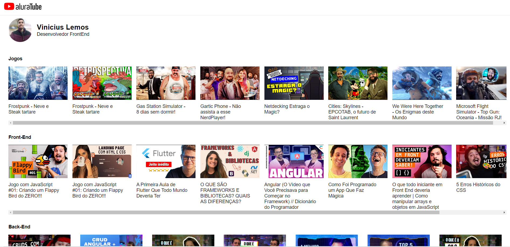

<h1 align="center">AluraTube - React</h1>

O AluraTube é um projeto de estudo de frontend, desenvolvido em ReactJS e NextJS.
Desenvolvido durante a semana da Imersão React da Alura.

- Vimos como usar Props no React
- NPM scripts
- Utilizamos o npx gitignore node para gerar o gitignore do projeto
- Vimos a criação de um componente com React
- Vimos como trabalhar com estilos no React
- Como trabalhar com StyledComponents
 

<h3> Projeto iniciado no dia 07/11/2022 e finalizado no dia 10/11/2022. </h3>

Deploy: https://alura-tube-imersao-react.vercel.app/

<h1 align="center">Print do Resultado</h1>

<h2 align="center">Tecnologias Usadas</h2>

     
 
        
        
        
        
       
    

